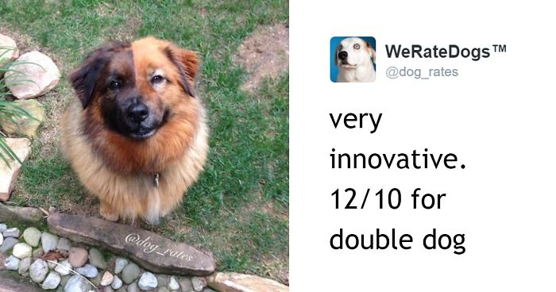

# They Rate Dogs

If you've spent time on Twitter, you've may have come across an account called "We Rate Dogs" that does just that: They rate dogs on a scale from 1-10.

However, the best part about it is that the author really loves dogs, and so they pretty much give every dog at least a 10 - and sometimes the dog is so cute it breaks the scale and gets an 11, a 12, or a 13.



## The Goal

Write some functions that take in some information about a dog and return a rating for that dog.

Follow the challenges in the file named dog_rater.py. When you're ready to test it, run it using the python command in the console:

```bash
python dog_rater.py
```

Be sure to *call* your functions somewhere in the dog_rater.py program in order for them to run, and if you want to actually *see* the results, be sure to print the return values.

```python
# Call your function:
example_function()

# Print the return value of this function:
print(example_function())
```

(It's okay to give really good ratings)

## BONUS: Random Numbers

You may find yourself wanting to make certain parts of the dog rater functions a little more wild and random. If so, you may want to know this cool Python function:

```python
x = randint(5, 10)
```

This code will pick a random integer between 5 and 10 and store it in the variable x, and then you can use it later.
But if you use the randint() function, you must remember to put the line `from random import randint` at the top of your program. This tells the computer where to find the definition for the randint() function, just like how you used `import budget` or `import diet` to allow your tests to access functions defined in other files earlier today.
